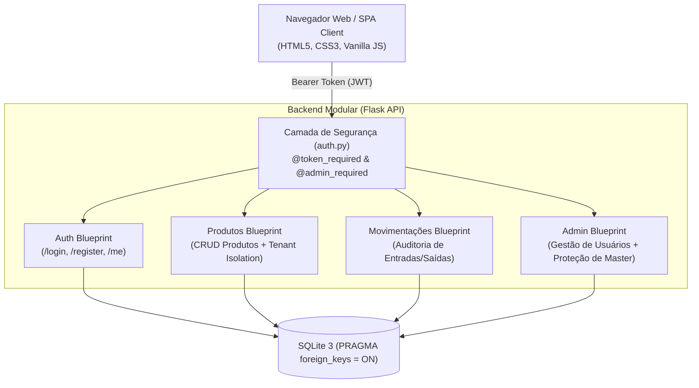

# 📦 SimpStock - Modern Inventory & Stock Management Platform

[](https://www.python.org/)
[](https://flask.palletsprojects.com/)
[](https://www.sqlite.org/)
[](https://jwt.io/)
[](https://www.docker.com/)
[](https://pytest.org/)
[](https://github.com/wthiagosan/SimpStock/actions)

> **Projeto Showcase de Engenharia de Software & Segurança Defensiva**  
> Plataforma de gestão de inventário e controle de fluxo de mercadorias desenvolvida com arquitetura modular desacoplada (**Flask Blueprints**), autenticação semântica via **JSON Web Tokens (JWT)**, criptografia defensiva (**Scrypt/PBKDF2**), proteção contra **IDOR (Insecure Direct Object References)** e auditoria transacional completa de movimentações.

---

## 🧭 Sumário Executivo

O **SimpStock** foi concebido para resolver os gargalos operacionais de controle de estoques em pequenos e médios lojistas, eliminando planilhas manuais e perdas de produtos por descontrole de validade ou falta de rastreio.

O sistema foi refatorado para operar sob os mais rigorosos padrões da indústria:
1. **Segurança Corporativa (OWASP Top 10):** Criptografia com salt para credenciais de usuários, validação estrita de integridade de sessão e controle de acesso baseado em funções (RBAC).
2. **Isolamento Multilocatário (Tenant Isolation):** Lojistas têm seus estoques estritamente isolados; o backend impede qualquer acesso não autorizado ou manipulação de produtos alheios (prevenção contra IDOR).
3. **Auditoria Contínua:** Todas as entradas, saídas ou ajustes manuais de estoque geram registros imutáveis na tabela de movimentações com identificação do operador responsável e timestamp.

---

## 🏗️ Arquitetura do Sistema

A aplicação adota o padrão **Client-Server RESTful** com divisão modular em camadas de controle, persistência relacional com integridade referencial via SQLite e clientes web desacoplados:



---

## 💎 Decisões Técnicas & Segurança (*Engineering Highlights*)

### 1. Criptografia Forte de Senhas (`werkzeug.security`)
- **Problema:** O armazenamento de senhas em texto plano ou com hashes fracos (MD5/SHA-1) expõe os usuários a ataques de dicionário e vazamentos.
- **Solução:** Implementação de algoritmos de derivação de chaves adaptativos com salt criptográfico (`scrypt`/`pbkdf2:sha256`), além de um mecanismo de migração transparente para credenciais pré-existentes durante a autenticação.

### 2. Autenticação Stateless Baseada em JWT com Validação Server-Side
- **Problema:** A autenticação ingênua confiando em parâmetros passados pelo cliente (`?is_admin=true&usuario_id=1`) permite falsificação imediata de identidade.
- **Solução:** Emissão de tokens JWT assinados com algoritmo **HS256** contendo claims temporais (`exp`, `iat`) e payload de autorização. Decoradores `@token_required` e `@admin_required` interceptam as requisições e associam contextualmente o usuário autenticado a `flask.g.user`.

### 3. Mitigação Robusta contra IDOR (Insecure Direct Object Reference)
- O ID do usuário logado é extraído exclusivamente do token criptográfico validado pelo servidor, nunca de campos editáveis pelo cliente.
- Lojistas só podem ler, atualizar ou excluir produtos vinculados à sua própria conta (`usuario_id = g.user['id']`), enquanto administradores mantêm visibilidade global.

### 4. Integridade Transacional e Rastreabilidade (ACID)
- Habilitação obrigatória de constraints relacionais no SQLite (`PRAGMA foreign_keys = ON`).
- Qualquer alteração na quantidade de um produto dispara automaticamente um registro de movimentação (`entrada` ou `saida`) com `diff` quantitativo e justificativa operacional.

---

## 📋 Matriz de Endpoints da API

| Método | Endpoint | Proteção | Descrição |
| :--- | :--- | :--- | :--- |
| `GET` | `/` | Pública | Healthcheck e metadados da API |
| `POST` | `/register` | Pública | Cadastro de novos lojistas com validação de senha |
| `POST` | `/login` | Pública | Autenticação e emissão de token JWT |
| `GET` | `/me` | `@token_required` | Dados do perfil do usuário autenticado |
| `GET` | `/produtos` | `@token_required` | Listagem de produtos (filtrada por lojista ou global para admin) |
| `POST` | `/produtos` | `@token_required` | Cadastro de produto com geração de movimentação inicial |
| `PUT` | `/produtos/<id>` | `@token_required` | Atualização de produto (com verificação de posse) |
| `DELETE` | `/produtos/<id>` | `@token_required` | Remoção de produto |
| `GET` | `/movimentacoes` | `@token_required` | Histórico de auditoria de estoque |
| `GET` | `/usuarios` | `@admin_required` | Listagem de todos os usuários (sem expor credenciais) |
| `DELETE` | `/usuarios/<id>` | `@admin_required` | Remoção de usuário (protegendo o Admin Principal) |

---

## 🚀 Como Executar o Projeto

### Opção A: Executar via Docker Compose (Recomendado)

Com o Docker instalado, execute na raiz do projeto:
```bash
docker compose up --build -d
```
A API estará operando em `http://localhost:5000` e com volume persistente para a base de dados.

---

### Opção B: Execução Local em Ambiente Python

#### 1. Clonar o Repositório
```bash
git clone https://github.com/wthiagosan/SimpStock.git
cd SimpStock
```

#### 2. Configurar o Ambiente Virtual
```bash
# Windows
py -3.12 -m venv venv
.\venv\Scripts\activate

# Linux / macOS
python3 -m venv venv
source venv/bin/activate
```

#### 3. Instalar Dependências
```bash
pip install -r requirements.txt
```

#### 4. Inicializar e Iniciar o Servidor
```bash
python app.py
```
O servidor será inicializado na porta `5000`.

---

## 🧪 Testes Automatizados

O projeto conta com suíte completa de testes unitários e de integração desenvolvidos em **pytest**:

```bash
# Execução da suíte completa de testes
pytest -v
```

**Cenários validados:**
- ✅ Validação de senha forte e rejeição de e-mails duplicados
- ✅ Autenticação JWT e proteção de rotas restritas
- ✅ Prevenção contra ataques de escalonamento de privilégios e IDOR
- ✅ Proteção contra exclusão acidental do Administrador Principal
- ✅ Registro e rastreio de movimentações de inventário

---

## 👥 Autores & Créditos

Projeto Integrador desenvolvido pela equipe de Ciência da Computação:
- **Welinton Sandrin**
- **Wesley da Silva**
